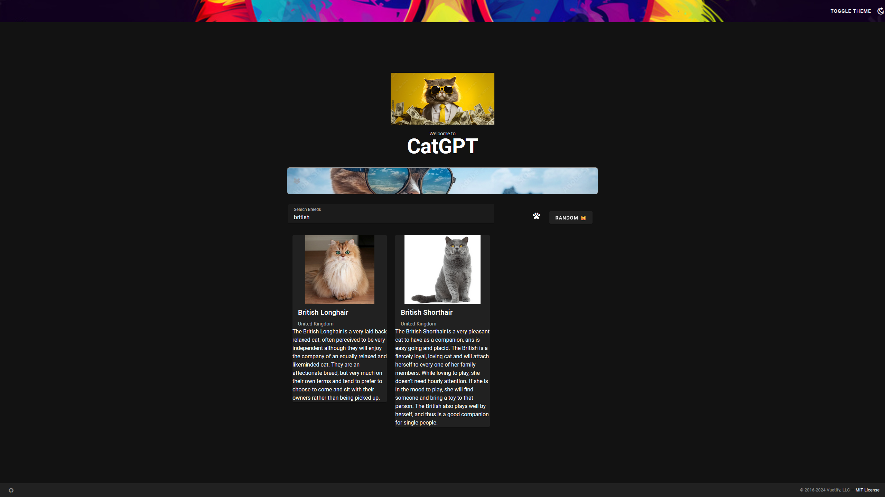

# CatGPT

Love cats and Vue 3? This interactive project lets you search for adorable cat images using the power of Vue 3 and Vuetify! Explore different breeds and categories with a user-friendly interface built with Material Design principles.

Medium article:
https://medium.com/@alikrc/catgtp-building-a-cat-image-application-with-vue-3-and-vuetify-7af89f88f567

Uses https://thecatapi.com/ to search for images. Visit to get an api key for free.

| Package Manager                                           | Command       |
| --------------------------------------------------------- | ------------- |
| [npm](https://docs.npmjs.com/cli/v7/commands/npm-install) | `npm install` |

## ✨ Features

- 😺 You can search for cat photos

## 💡 Usage

### Starting the Development Server

To start the development server with hot-reload, run the following command. The server will be accessible at [http://localhost:3000](http://localhost:3000):

```bash
npm run dev
```

## 📑 License

[MIT](http://opensource.org/licenses/MIT)
